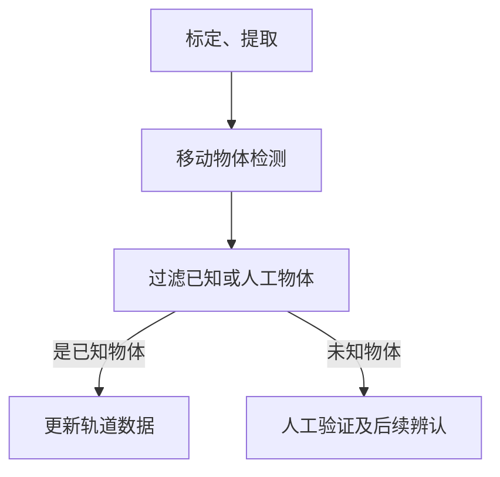

[toc]

# 小行星探测发现与研究 - asteroids

> 小行星：绕太阳公转、体积质量明显小于行星、矮行星、基本不释放气体和尘埃的天体
> 探测方法：地基观测，空间探测（掠过、绕行观测，采样返回）
> 研究目标：
>   - 识别潜在威胁地球的天体及其起源；
>   - 探究太阳系行星形成；
>   - 探究太阳系起源；
>   - 行星际资源利用。

- 小行星轨道位置分类【分类标准多：如光谱特征、轨道位置等】
  - 内太阳系
    - 近地
    - 主带
    - 木星特洛伊
  - 外太阳系
    - 半人马天体
    - 海王星外天体

近地小行星对地球有潜在的碰撞威胁，是重点研究对象
- 近地小行星NEA巡天数据处理

## 主要巡天/观测项目

> 目前已发现总数：微型行星minor planets 1.4m，其中NAEs 38k，
> 数据来源：MPC https://minorplanetcenter.net

- Catalina Sky Survey (CSS)
- Panoramic Survey Telescope and Rapid Response System (Pan-STARRS)
- Asteroid Terrestrial-impact Last Alert System (ATLAS)
- ...

## 数据处理、流向

- NEA观测数据类型
  - 地基望远镜，光变数据
  - 雷达回波数据，
  - 光谱数据
  - 空间探测器的抵近探测，科学载荷

### CSS巡天数据处理 
  - Catalina Sky Survey - asteroids discovery, 目前发现小行星数量最多的巡天项目
    - CSS 处理数据 https://sbnarchive.psi.edu/pds4/surveys/gbo.ast.catalina.survey/document/CSS_operations_v8.pdf
      - calibration 标定（图像，天体测量，光度测量）
      - source extraction
      - 图像提取
      - 移动物体检测
      - 已知物体检测、未知候选体评分
      - 人为验证、MPC报告生成
      - 后续辨认自动化确认
    - 课题组自己处理
    - 流向/使用场景
      - 近地天体NEO发现与确认
      - NEO轨道
      - NEO预发现 precoveries
      - 主带小行星天体测量
      - 彗星
      - ...

### 以ATLAS Asteroid Terrestrial-impact Last Alert System 为例

- 常用处理方向/子任务 - 各类巡天项目共同的
  - 发现新的近地小行星/NEO
    - 对同一片天区长曝光拍摄多次, 比较每次拍摄图片, 识别移动物体(moving objects), 排除人造物和已知天体.    
  - 现有巡天数据的利用 - 更新轨道信息、星表，详细分析具体的小行星，了解成形原因，太阳系形成历史
    - 图像处理 image process 
    - 相变曲线 Phase Curve Analysis https://arxiv.org/html/2503.05412v1
      - 表面反照率特征
      - 表面粗糙度与结构
      - 形状与自转
    - 测光分析 photometry analysis
    - 轨道参数
- 当前问题
  - 如何高效处理海量、复杂的巡天数据（TB/天，存储、实时处理挑战，数据维度多）？暂未找到当前主要使用的巡天数据处理模型及其待改进的地方，也许每个巡天项目的处理各有不同。
  - 过滤人工物体artifical objects
- 未来趋势
  - 完善近地小行星数据库，实时监测并预警潜在威胁
  - 结合空间望远镜、空间探测器，开展更多的小行星采样返回分析其成分性质，探究其形成起源、更新我们对行星与太阳系起源相关问题的认知、探索度。
  -  New discoveries with Vera C. Rubin Observatory (LSST) 
     - https://arxiv.org/pdf/0805.2366
     - https://rubinobservatory.org/about/history
     - Rubin Science Platform

# 宇宙早期原初星系团 - protocluster

> 2018 - The realm of the galaxy protoclusters - a review
- 定义
- 现有理论（形成、演化）
- 搜寻方法
- 展望（未来发展方向

## 1. Scope

### discuss

  - 主要搜寻技术 main search tech
  - 观测和模拟中的特征属性characteristic prop, observation and simulation

### show

- 原初星系团中，高红移的大质量光晕 most massive halos at high redshift found in protoclusters
- 星系起源 galaxies origin
- 与射电星系等的联系 connections with radio gala, qua, Lya blobs
- 观测项目 observational projects

### 定义 definition 

cluster <- protocluster M >~ 10^14 M0
在某个阶段会坍缩成一个稳定的星体团（M >~ 10^14 M0）的结构

## 2. Searching for protoclusters

- 高红移星系团巡天 high redshift cluster survey
  - 红移序列， 恒星形成隆起 techniques: red sequence, stellar bump method
-  z ≳ 2 处的搜寻 Protocluster searches at z ≳ 2
  - 大型光谱巡天 large spectroscopic surveys
    - Canada–France–Hawaii Telescope Legacy Survey
    - VIMOS Ultra Deep Survey
    - serendipitously from the Planck survey
  - 偏置示踪技术 Biased tracer techniques
  - 气体吸收研究 Gas absorption studies
- ... 
  - [TBD] any other method?
  - [TBD] limitations of current methods
  
## 3. 已找到的 Objects found

- 分布 distribution in
  - 按红移 redshift 1/2: z2~3, 1/2: z3~8
  - 过密度 overdensities
  - 星系类型 galaxy type to measure overdensities

- 预估的当下质量要大于10^14 M0 why we believe these are protoclusters: estimated present-day mass > 14 M0
  - 如何估计当下质量 how to estimate
    - 过密度需要足够大 （多大才是足够大？）overdensity needs to be large enough
    - 能在z=0前就坍缩成星系团 collasp into a cluster before z=0
  - 用于估计的模型 models to estimate
    - 球形坍缩 spherical collapse
    - 数值仿真模拟 numerical simulations
    - 其他质量测量方法 other mass measurements methods: dynamical masses, stellar mass-based masses and X-ray masses

## 4. 属性 Properties

- as a probe of structure formation
- red sequence
- brightest cluster 
- others
  - morphologies
  - stellar populations, star formation
  - gas-phase metal abundances
  - AGN fraction of galaxies in protoclusters

## 5. Connections with Lyα blobs, radio galaxies, QSOs, reionizations

## 6. 展望 Outlook

- 未来的观测：更宽、更深的视野，获取更多原初星系团样本 future observations, wider and deeper, more samples
  - [TBD] potentials 

Nature - A Lyman-α PROTOCLUSTER AT REDSHIFT 6.9
https://arxiv.org/pdf/2101.10204
