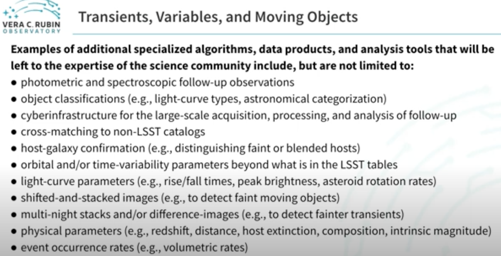
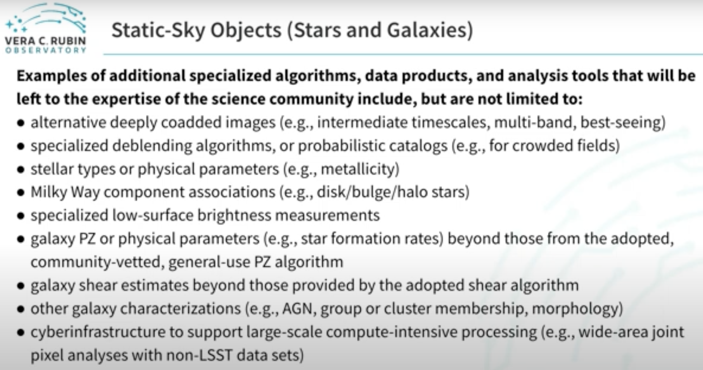
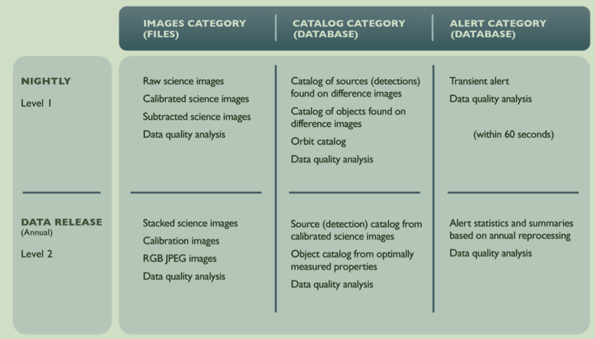

[toc]

# 小行星探测与研究

> 小行星：绕太阳公转、不满足行星、矮行星的天体
> 探测方法：地面观测，掠过、绕行观测，采样返回

## 国际发展历程及现状

- 美 顺访
- 日 采样返回
- 欧 
- 中 月球采样返回

## 子任务

- 发展探测技术，使得探测器能抵达更远、更多种类的小行星，并采样返回，对小行星样本进行分析。提升对太阳系早期演化的认识
    - 长寿命电推进
    - 小天体表面附着技术
    - 微重力条件下采样技术
    - 精确定点附着控制
    - 轻小型化高速再入返回

- 巡天数据处理 > 找课题组相关文章 【数据来源：MPC，各巡天项目】
  - ~~以LSST的数据处理为例 in asteroid https://arxiv.org/pdf/0805.2366~~
  - Catalina Sky Survey - asteroids discovery, 目前发现小行星数量最多的巡天项目
    - CSS 处理数据 https://sbnarchive.psi.edu/pds4/surveys/gbo.ast.catalina.survey/document/CSS_operations_v8.pdf
      - calibration 标定（图像，天体测量，光度测量）
      - source extraction
      - 图像提取
      - 移动物体检测
      - 已知物体检测、未知候选体评分
      - 人为验证、MPC报告生成
      - 后续辨认自动化确认
    - 课题组自己处理
    - 使用场景
      - 近地天体NEO发现与确认
      - NEO轨道
      - NEO预发现 precoveries
      - 主带小行星天体测量
      - 彗星
      - ...
  - 以ATLAS Asteroid Terrestrial-impact Last Alert System 为例
  > how LSST processes the data to identify new asteroids：提供基本处理，后续的特殊处理由science community自行处理，如 
    - ~~LSST数据管理、处理的架构简介~~
      - layer 1，2，3 
    - 常用处理方向/子任务 - 各类巡天项目共同的
      - 发现新的近地小行星/NEO
        - 对同一片天区长曝光拍摄多次, 比较每次拍摄图片, 识别移动物体(moving objects), 排除人造物和已知天体.    
      - 现有巡天数据的利用 - 详细分析具体的小行星，了解成形原因，太阳系形成历史
        - image process - 
        - 相变曲线 Phase Curve Analysis https://arxiv.org/html/2503.05412v1
          - 表面反照率特征
          - 表面粗糙度与结构
          - 形状与自转
        - photometry analysis
        - 轨道参数
    - 数据处理流程
      - 通过巡天项目的pipeline（图像）初步辨认，结合现有星表或catalog分离出已知小行星，通过分析一段时间的数据，判断新的符合小行星定义的天体来发现新的小行星
    - [TBD] 当前问题有哪些
      - 每天需要处理的数据量巨大（存储、实时处理挑战）
      - 过滤artifical objects
    - [TBD] 未来趋势
      - 
  

- 近地小行星
  - 数据类型
      - 地基望远镜，光变数据
      - 雷达回波数据，
      - 光谱数据
      - 空间探测器的抵近探测，科学载荷

  - 分析维度
    - 测站，
    - 发现数目
    - 直径，星等
    - 轨道类型，地心距
    - 发现时刻的位置分布

- 小行星防御与资源利用

# 宇宙早期原初星系团 protocluster

> 2018 - The realm of the galaxy protoclusters - a review

## 1. Scope

### discuss

  - main search tech
  - characteristic prop, observation and simulation

### show

- most massive halos at high redshift found in protoclusters
- galaxies origin
- connections with radio gala, qua, Lya blobs
- observational projects

### definition 

cluster - protocluster M >~ 10^14 M0

## 2. Searching for protoclusters

- high redshift cluster survey
  - techniques: red sequence, stellar bump method
-  Protocluster searches at z >~ 2
  - large spectroscopic surveys
    - Canada–France–Hawaii Telescope Legacy Survey
    - VIMOS Ultra Deep Survey
    - serendipitously from the Planck survey
  - Biased tracer techniques
  - Gas absorption studies
- ... 
  - [TBD] any other method?
  - [TBD] limitations of current methods
  
## 3. Objects found

- distribution in
  - redshift 1/2: z2~3, 1/2: z3~8
  - overdensities
  - galaxy type to measure overdensities

- why we believe these are protoclusters: estimated present-day mass > 14 M0
  - how to estimate
    - overdensity needs to be large enough
    - collasp into a cluster before z=0
  - models to estimate
    - spherical collapse
    - numerical simulations
    - other mass measurements methods: dynamical masses, stellar mass-based masses and X-ray masses

## 4. Properties

- as a probe of structure formation
- red sequence
- brightest cluster 
- others
  - morphologies
  - stellar populations, star formation
  - gas-phase metal abundances
  - AGN fraction of galaxies in protoclusters

## 5. Connections with Lyα blobs, radio galaxies, QSOs, reionizations

## 6. Outlook

- future observations, wider and deeper, more samples
  - [TBD] potentials 

Nature - A Lyman-α PROTOCLUSTER AT REDSHIFT 6.9
https://arxiv.org/pdf/2101.10204
