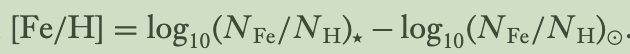

目录
[toc]

 

# 积分场光谱IFS

# 极贫金属恒星

1. 什么是极贫金属恒星？
2. 极贫金属恒星为什么重要，为什么要研究它？
3. 如何在观测中寻找极贫金属恒星？
4. 当前研究进展如何？

> 文献
https://arxiv.org/html/2504.06335v2 - The most metal poor stars review of observational results from 2015 to 2025
Near-Field Cosmology with Extremely Metal-Poor Stars
> https://space.mit.edu/home/afrebel/review_frebel.pdf

  > 设备：俄罗斯6米望远镜 Big Telescope Alt azimuthal，BTA

- 定义 [1] the term extremely metal-poor star refers to stars [Fe/H] < - 3.0 (different values in different researches)
- [Fe/H]的含义

- [2] chemical evolution, early universe
- to study the formation and evolution of the elements and the involved nucleosynthesis processes; offer crucial observational constraints on the nature of the first stars, provide archaeological evidence of the earliest times of the Universe

- chemical abundance 化学丰度的作用
  - 两项假设，使得其成为研究早期宇宙和星系形成与演化的重要媒介
    - 奇点后几分钟，氢氦锂
    - [存疑] 最古老的恒星是那些重元素总丰度最低的恒星
- The Search for Extremely Metal-Poor Stars in the Galactic Halo
  - 意外发现
  - High proper-motion surveys
  - Schmidt objective-prism surveys
  - 光谱巡天
    - SDSS，LAMOST
  - 测光巡天
- 高分辨率、高信噪比的后续光谱丰度分析 
  - Ca, Li, C, O...

- Properties of the First Stars and the Nature of the First Chemical Enrichment Events
  - Interpreting the Abundance Signatures of Extremely Metal-Poor Stars

