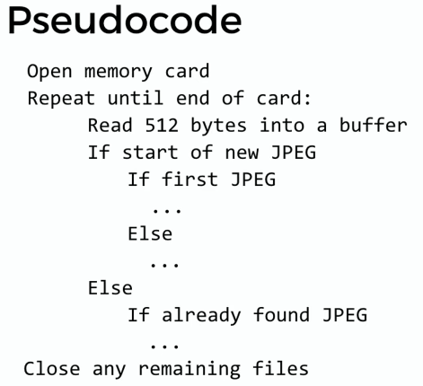

https://cs50.harvard.edu/x/2025/faqs/#obtaining-your-certificate

Enrolled - you can find everything about this course on this website, including the code/arguments you will use when solving psets.

[What's next]
    - [Data science](https://datascience.quantecon.org/)
    - [cs50AI](https://cs50.harvard.edu/ai/2024/)

[本地环境太shi了]

## psets

My submissions: 
https://submit.cs50.io/users/wooo0214

- common command-line arguments:
    - cd, for changing our current directory (folder)
    - cp, for copying files and directories
    - ls, for listing files in a directory
    - mkdir, for making a directory
    - mv, for moving (renaming) files and directories
    - rm, for removing (deleting) files
    - rmdir, for removing (deleting) directories
    - code hello.c

- week 0 scratch

    a space tour, 
    launch from earth or other customized planets, 
    one button to accelerate to reach the escape speed, 
    round tour of the planet before leaving
    accelerate to reletivity speed and head to Centaurus
    To be continue...

    Requirememts
    - 2 sprites: spacecraft, you
    - at least three scripts
    - 1 custom block with 1 input
        engine, using keyboard space as input
    - 1 loop
    - 1 conditional
    - 1 variable

### [done] psets1

    - mario more
    https://cs50.harvard.edu/x/2025/psets/1/mario/more/

    Finally get it working. first check results: my actual output has more whitespaces at the end of each line compared with expected results
    https://submit.cs50.io/check50/66be72db646655c3ae5edacf950bb1f8069acdf6

    second submit done with the help of cs50 duck and https://www.w3schools.com/c/c_strings.php and tutorialspoint (online compiler) to try out printf:

    #include <stdio.h>

    int main()
    {

        char str[] = "##"; 
        int width = 15; 
        printf("|%*s|  |%s|\n", width, str, str); 

        return 0;
    }

    - credit cards

    - cash
    submitted
    
### [done] psets2
- scrabble
- readability
- caesar

### [done] pset3

### [done] pset4
- submitted filter-less
- done
> debug: printf to see which parts are executed and variables during loops

### pset5

Two issues:
- memory leak > create_family has a copy paste error where I accidentally set new_person->parent0 = NULL twice
- recursive function

void free_family(person *p)
{
    // TODO: Handle base case: input is null
    if (p == NULL)
    {
        return;
    }

    // TODO: Free parents recursively
    if (!(p->parents[0] == NULL))
    {
        free_family(p->parents[0]);
        free_family(p->parents[1]);
    }
    // TODO: Free child
    else
    {
        free(p);
    }

    //free(p);

}

free(p) should be removed within else, and move to the end

## Notes

### Week 4 memory

> time to get off training wheels <cs50.h>

#### '*' and  '&'

> '*' 声明指针 vs 声明引用
'*' is used to declare pointers and to dereference them.
'&' is used to declare references （引用） and to get the address of a variable.

Without using cs50.h, string s is actually char *s which is the *address* of the first character in an array of characters
When you use s[0], it is actually do *s

char *s = get_string("s: ");
printf("%p\n",s ); // this will print out the value of s, which is the address of the first character in an array of characters
printf("%s\n",s ); // this will print out the input string

#### malloc and free

malloc returns an address, meaning a pointer

char *s = get_string("s: ");
if (s == NULL)
{
    return 1
}

char *t = malloc(strlen(s) + 1);

if (t == NULL)
{
    return 1; // malloc returns the first address of the char array, if memory is run out, malloc returns NULL
}

for (int i = 0, n = strlen(s); i <= n; i++) // i <= n will copy the last char '\0' from s to t
{
    t[i] = s[i];
}

this can be achived by strcpy(t, s)

free(t);
return 0;

#### valgrind

> valgrind ./memory

check memory related bugs 

int *x = malloc(sizeof(int)); 
int *y = malloc(3 * sizeof(int)); 

#### passing by value vs by reference

void swap(int a, int b) // by value

void swap(int *a, int *b) // by reference, input parameter should be the address of the variable
{
    int tmp = *a;
    *a = *b;
    *b = tmp;
}

int x = 1;
int y = 2;
swap(&x, &y) // &x is to get the address of x

#### get rid of cs50.h

<stdio.h>

int n;
printf("n: ");
scanf("%i", &n);
printf("n: %i\n", n);

#### discussion

pointers
address - value
0x500000 - 3 // this is a variable, int a = 3;
0x500004 - 0x500000 // this is a pointer, int *p = &a; int here means the pointer points to a integer.

key syntax
- type * is a pointer that stores the address of a type
- *x takes a pointer x and returns the value stored in that address
- &x takes x and gets its address

#### Pseudocode structure

### Week 5 data structures

array , contagious
linked list, dynamic to add elements