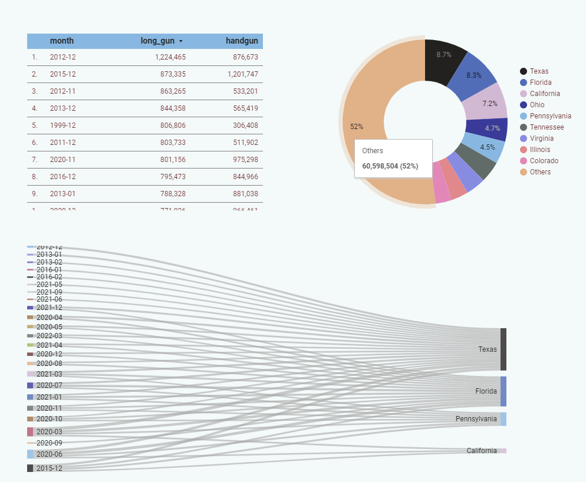

# Tableau

### 使用界面

### 图表类型

1. 直方图

    前处理- 拆分；格式转换（日期等）（可用py做更细致的前处理，格式统一之类；tableau强在可视化）

1. 折线图
饼图与环形图
 pie --> 环形图 两种方式：智能显示，标记

1. 基本表

1. 凸显表

1. 树形图 - 快捷方式：智能显示；大小和颜色深浅可表示两个维度

1. 气泡图与词云 - 快捷方式：智能显示。标记类型 圆-->文本：气泡图-->词云

1. 标靶图 - 体现标准值与实际值的差别
1. 甘特图 - （时间做横轴，颜色为绿色。蓝色的是维度，不能用来比较大小）
1. 瀑布图 - 汇总

    > 添加自定义形状：D:\Program Files\Tableau\Tableau 10.5\defaults\Shapes 

1. 仪表板：展示工作表，分区

# Power BI

# Looker Studio

> Looker Studio, formerly Google Data Studio, is an online tool for converting data into customizable, informative reports and dashboards.

> Quick start:    
https://support.google.com/looker-studio/answer/9171315?hl=en&ref_topic=6267740&sjid=7380730750791305113-NC

## Example: gun permission by states

    steps: 
    - import data or connect to a data source
    - add chart, select dimensions (x axis) and metric (y axis)
    - use logo or image to set theme colors
    - dive 

